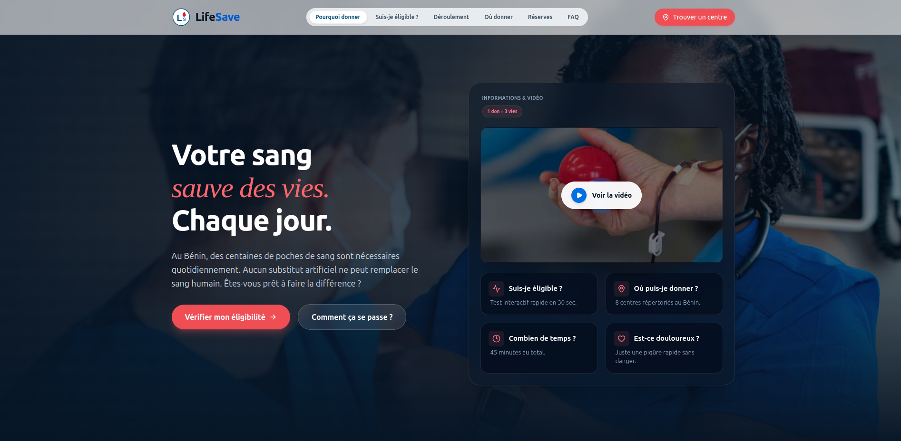

# LifeSave

Landing page d'information sur le don de sang — Figma to Code Challenge, Édition 4 (« Un sujet, une IA, votre instinct »).

**Démo :** https://lifesaved.netlify.app/  
**Repository :** https://github.com/tatchintate/lifesave



## À propos

LifeSave s'adresse à toute personne qui envisage de donner son sang pour la première fois, mais hésite encore : suis-je éligible, où puis-je aller, à quoi dois-je m'attendre ? La page est purement informative — aucune transaction, aucun compte, aucun téléchargement requis.

Objectif : qu'un visiteur reparte avec trois certitudes — **son éligibilité**, **le lieu de rendez-vous** et **le déroulement de l'expérience**.

## Fonctionnalités

- **Pourquoi donner** — impact concret du don, enjeux de santé publique et chiffres clés à haut impact
- **Qui peut donner** — critères généraux d'éligibilité (âge 18–65 ans, poids ≥ 50 kg, délai post-don 3 mois homme / 4 mois femme)
- **Test d'éligibilité** — simulateur interactif : éligible / non éligible avec motif / date de prochaine éligibilité calculée
- **Déroulement et préparation** — parcours étape par étape, conseils avant / pendant / après
- **Où donner** — répertoire des 8 centres répertoriés au Bénin (adresse, horaires, statut en direct, types de dons), avec recherche et filtres par ville / type de don
- **État des réserves** — visualisation élégante en mode sombre par groupe sanguin (jauges et niveaux de tension)
- **FAQ** — réponses aux craintes et idées reçues les plus courantes sous forme d'accordéon réactif

> Ces règles d'éligibilité sont simplifiées pour les besoins du challenge. Seul un entretien médical avec un professionnel de santé peut confirmer l'aptitude réelle au don.

## Direction artistique

Trois notions guident l'identité visuelle : **confiance** (nuances sombres et structurées), **humanité** (rouge/rose corail, utilisé avec parcimonie pour rester rassurant plutôt qu'anxiogène) et **clarté** (espaces blancs, hiérarchie typographique nette, glassmorphism). Palette et tokens définis dans `src/Styles.css` (Tailwind v4, config CSS-first).

## UX & accessibilité

- Navbar : états actifs, indicateur glissant (*sliding pill*), masquage intelligent au scroll, menu mobile responsive
- Micro-interactions sur `transform`/`opacity` uniquement, transitions 200–400 ms fluides
- Navigation clavier, focus visibles, contraste suffisant, `prefers-reduced-motion` respecté
- Responsive de 390px à 1440px+

## Stack technique

- **React 19 + Vite**
- **Tailwind CSS v4** (config CSS-first, `@theme`)
- **lucide-react** (icônes vectorielles modernes)

Détail de la méthodologie IA (outils, prompts significatifs, ajustements manuels, limites rencontrées) : voir [`PROMPT.md`](./PROMPT.md).

## Installation

```bash
git clone https://github.com/tatchintate/lifesave.git
cd lifesave
npm install
npm run dev
```

Build de production :

```bash
npm run build
npm run preview
```

## Structure du projet

```
src/
├── assets/
│   ├── blood.png
│   ├── hero.png
│   └── lifesave.png
├── components/
│   ├── layout/
│   │   ├── Navbar.jsx
│   │   ├── Footer.jsx
│   │   └── MobileStickyCta.jsx
│   ├── sections/
│   │   ├── Hero.jsx
│   │   ├── WhyGive.jsx
│   │   ├── Eligibility.jsx
│   │   ├── ProcessAndPrep.jsx
│   │   ├── Centers.jsx
│   │   ├── Reserves.jsx
│   │   └── Faq.jsx
│   └── ui/
│       ├── Button.jsx
│       ├── Logo.jsx
│       └── TypewriterText.jsx
├── data/
│   └── centres.js
├── hooks/
│   ├── useInView.js
│   └── useReducedMotion.js
├── lib/
│   ├── eligibility.js
│   └── utils.js
├── Styles.css
├── App.jsx
└── main.jsx
```

## Liens

- **Démo en ligne :** https://lifesaved.netlify.app/
- **Repository GitHub :** https://github.com/tatchintate/lifesave
